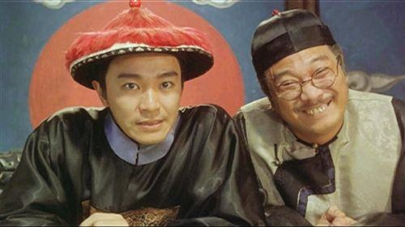
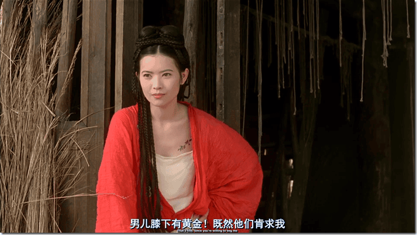
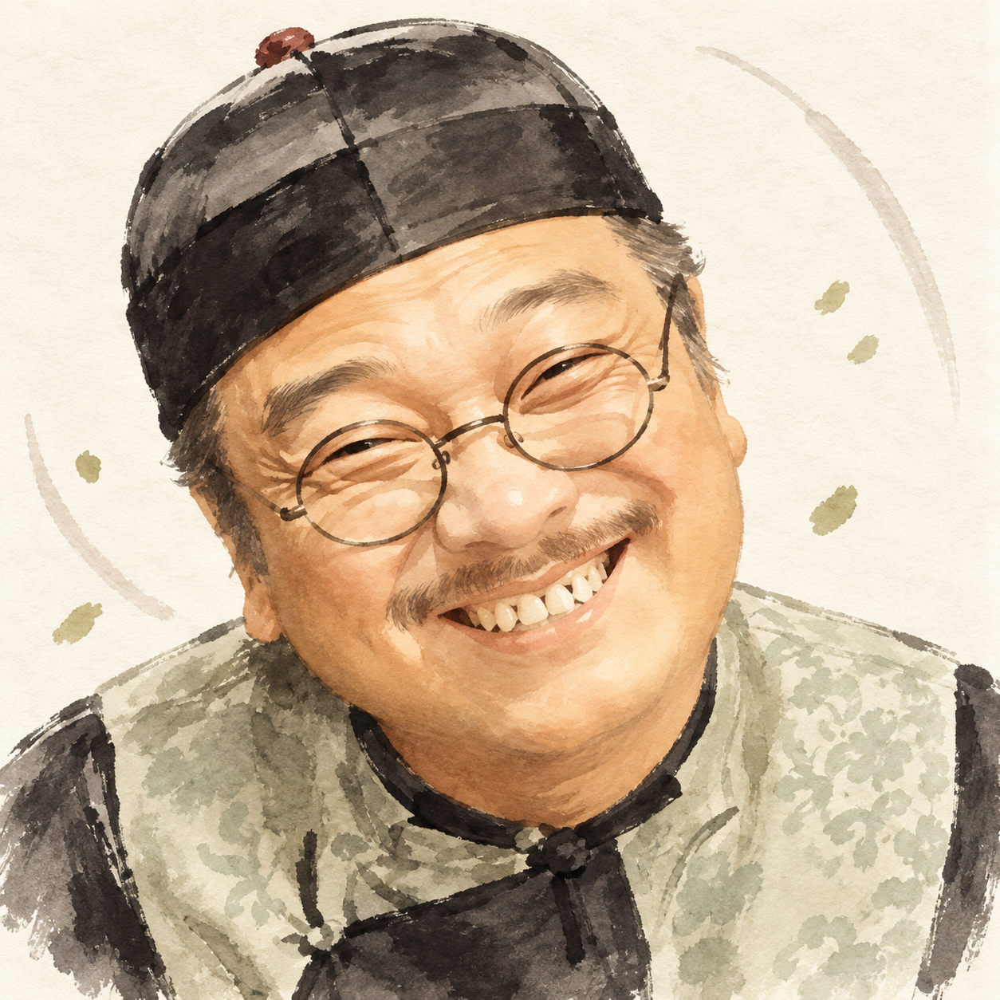
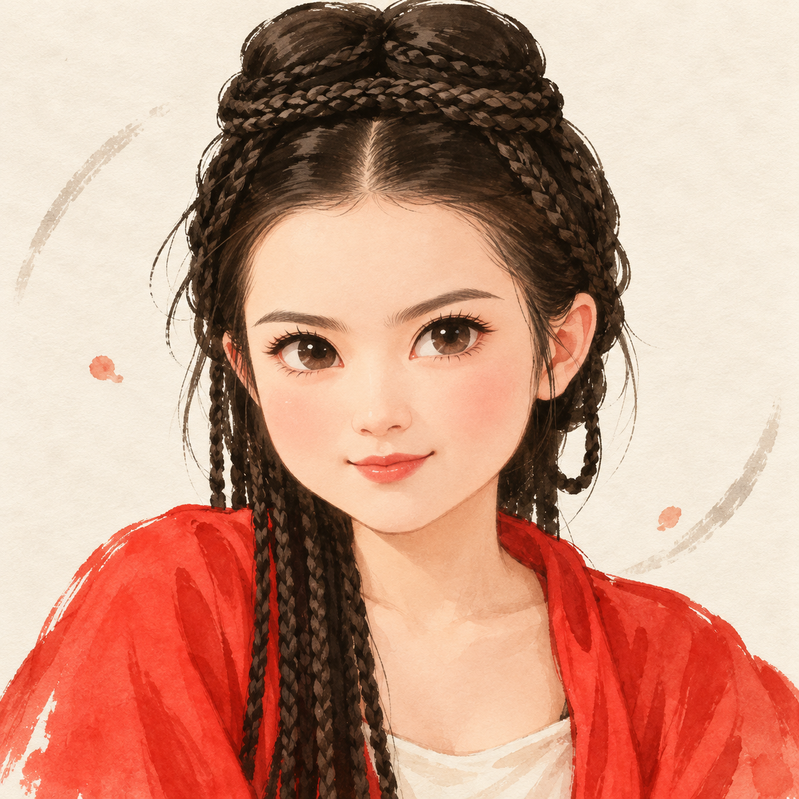
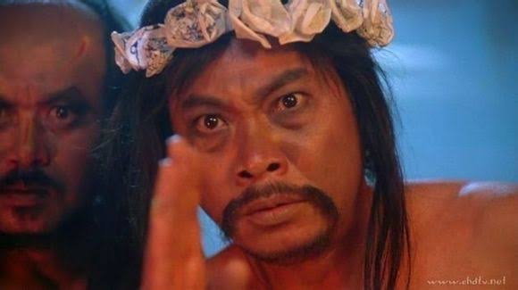
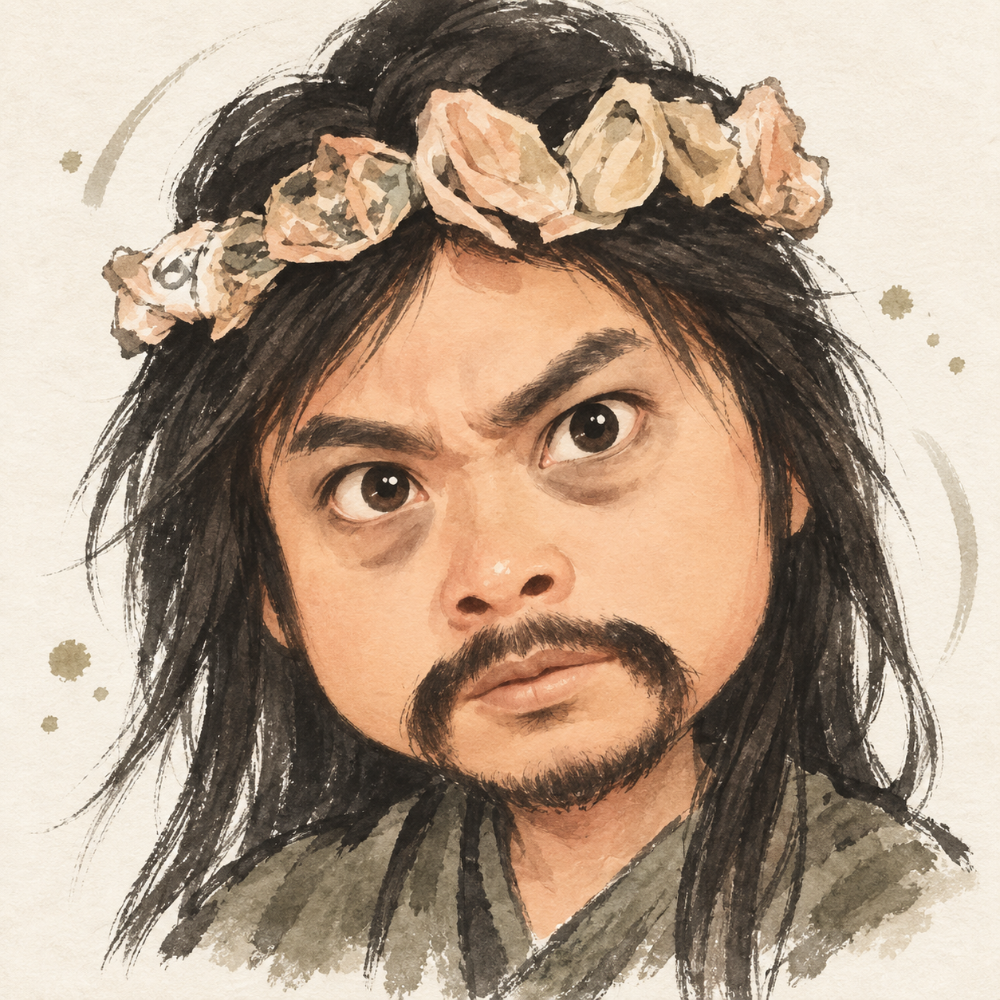
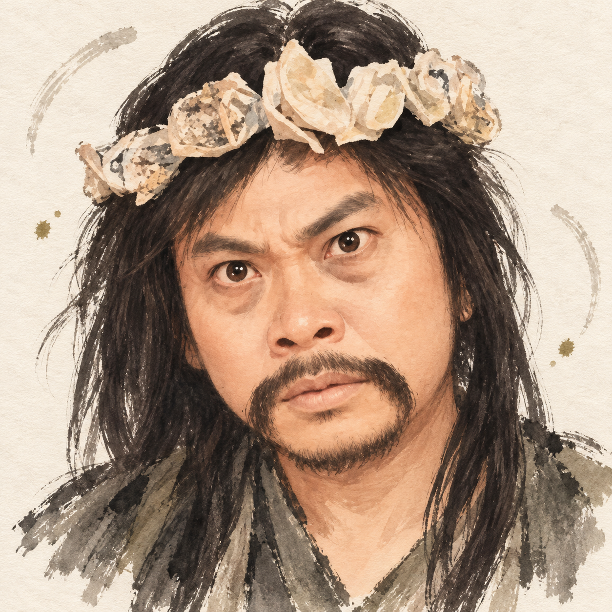
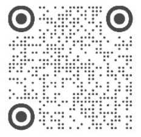

# Ink Chibi Avatar Skill

`ink-chibi-avatar-skill` 将参考图转换为固定风格的 1:1 水墨 Q 版头像


## 效果预览

以下是仓库内置的默认 `realism: 0.6` 验收结果。

| 眼镜笑脸                                                                                | 红衣编发                                                                           |
| --------------------------------------------------------------------------------------- | ---------------------------------------------------------------------------------- |
| **原图**<br>                                             | **原图**<br>                            |
| **默认 `realism: 0.6`**<br> | **默认 `realism: 0.6`**<br> |

### 不同参数：`realism: 0.4` 与默认 `0.6` 对比

同一参考图中，`0.4` 使用更明显的 Q 化、圆润脸部与放大眼神；默认 `0.6` 则保留更多五官关系、胡须和表情。两档都使用明亮的手绘肤色，不把原图的暖暗光当成基础肤色。

| 原图                                              | `realism: 0.4`                                                       | 默认 `realism: 0.6`                                                  |
| ------------------------------------------------- | -------------------------------------------------------------------- | -------------------------------------------------------------------- |
|  |  |  |

## 

## 使用方法

### 1. 安装

将整个目录放进 Codex 的 skills 目录，保持 `SKILL.md` 位于目录根部。例如：

```bash
mkdir -p ~/.codex/skills
cp -R ./ink-chibi-avatar-skill ~/.codex/skills/
```

目录名与 `SKILL.md` 中的 `name` 必须保持为 `ink-chibi-avatar-skill`。之后在支持图像生成的 Codex 会话中，可直接用自然语言触发，也可显式引用 `$ink-chibi-avatar-skill`。

**或者，把仓库地址告诉你的Agent，然后进入下一步**

### 2. 最小请求

附上一张清晰的人物参考图，然后说明：

```text
基于这张图生成水墨 Q 版头像，使用默认参数。
```

默认参数为 `realism: 0.6`，适合大多数头像场景：优先保留人物神态、主要五官关系与关键辨识点，同时用克制的成人 Q 版比例呈现。

### 3. 指定参数

```text
使用 $ink-chibi-avatar-skill，基于这张参考图生成 1:1 水墨 Q 版头像。
realism: 0.6
expression: 眉头微挑、侧目、嘴角轻轻上扬
face-shape: subtle
```

| 参数         | 默认值     | 说明                                                                              |
| ------------ | ---------- | --------------------------------------------------------------------------------- |
| `realism`    | `0.6`      | `0.0–1.0` 的写实保留度。值越低，Q 化越强；值越高，保留越多原图的五官结构与表情。  |
| `expression` | 参考图决定 | 用一句话补充眼神、眉毛、嘴角、视线与头部角度。必要时可以补充一个小手势。          |
| `face-shape` | `subtle`   | 默认不额外拉宽或拉长脸部；仅在明确要求时使用 `wider`、`longer` 或自定义夸张方向。 |

### 4. `realism` 的选择

| 范围        | 适用效果                                                    |
| ----------- | ----------------------------------------------------------- |
| `0.0–0.45`  | 更强、更俏皮的 Q 化，脸部细节最少。                         |
| `0.46–0.59` | 更强的 Q 化：神态清晰、脸部细节更简化。                     |
| `0.60–0.80` | 默认区间。保留更多眉眼、脸型与表情，以克制 Q 化维持辨识度。 |
| `0.81–1.0`  | 更强调参考图结构；仍不会生成照片级皮肤纹理。                |

## 关注

欢迎一起交流，微信小红书同名：知之为知之知

| 微信公众号                                                                            | 小红书                                  |
| ------------------------------------------------------------------------------------- | --------------------------------------- |
| 扫码关注公众号                                                                        | 扫码关注小红书                          |
|  |  |
